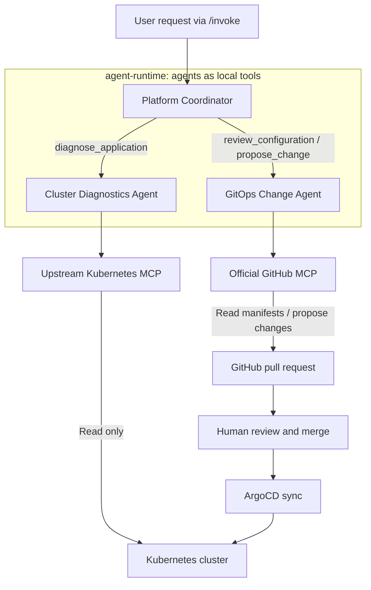

# Lab 3: GitOps Changes and Agent Collaboration

Add a GitOps Change Agent and a Platform Coordinator that delegates to both specialists. You will connect live diagnosis to Git manifest inspection and an image-repair PR, with a hook checking proposal conventions before human review and merge.

The coordinator uses each specialist agent as a local tool. This keeps the lab simple: one runtime can share the session, budget, and handoff context without introducing service discovery or another deployment. The same specialists could be deployed independently later and connected through an Agent2Agent (A2A) protocol when they need separate scaling, ownership, or release lifecycles.



The coordinator calls specialist tools and receives their results within the same runtime. Each specialist owns its MCP connection; deployment changes reach the cluster through a reviewed PR and ArgoCD.

## Trace the handoff

Each agent has its own file. The Platform Coordinator is the entry point and decides when to delegate. Read its complete definition:

```bash
cd "$BOOK_REPO/chapter-07/3-gitops-mcp"
cat "$BOOK_REPO/chapter-07/3-gitops-mcp/files/agent/app/platform_coordinator.py"
```

The coordinator has local memory and Backstage search tools, plus three handoff tools: `diagnose_application`, `review_configuration`, and `propose_change`. It does not receive Kubernetes or GitHub MCP tools directly.

The diagnostics agent is given the Kubernetes MCP tools and a read-only diagnostic prompt:

```bash
cat "$BOOK_REPO/chapter-07/3-gitops-mcp/files/agent/app/diagnostics_agent.py"
```

Its MCP tools are `resources_get`, `resources_list`, `pods_list_in_namespace`, `pods_get`, `pods_log`, and `events_list`.

The GitOps agent is given the GitHub MCP tools and the pull-request prompt:

```bash
cat "$BOOK_REPO/chapter-07/3-gitops-mcp/files/agent/app/gitops_agent.py"
```

Its GitHub MCP tools are `get_file_contents`, `create_branch`, `create_or_update_file`, and `create_pull_request`; it also receives the local `consult_skill` tool for the image-repair procedure.

The `agent-runtime` Deployment supplies the GitHub owner, repository name, and default branch to the GitOps agent. That specialist owns this repository context and derives the manifest path as `<application>/k8s/deployment.yaml`; the coordinator only passes the application, evidence, and requested change.

The specialists are created with the coordinator for each request and reused across its handoffs. The coordinator restores conversation history using the session ID. A per-request scope and tool budget keep the specialists focused on the requested application. Chapter 8 adds identity and policy enforcement to these boundaries.

## Inspect the PR path and hook

These files implement the reviewed-change path. `hooks.py` is a code hook that rejects PR requests without the `[agent]` title prefix or a useful rationale. `SKILL.md` is the procedure the GitOps agent follows when diagnosing and repairing an image tag. GitHub's official MCP server supplies the repository and pull-request tools.

```bash
sed -n '/class AlwaysPRHook/,$p' "$BOOK_REPO/chapter-07/3-gitops-mcp/files/agent/app/hooks.py"
```

This is the executable PR-format check. It runs before the PR tool and validates proposal quality, not user permission.

```bash
sed -n '/## Procedure/,/## Output/p' "$BOOK_REPO/chapter-07/3-gitops-mcp/files/skills/fix-image-tag/SKILL.md"
```

This is the procedural checklist loaded by the GitOps agent for an image-tag repair. It requires evidence, an image-only edit, and a pull request.

The GitOps agent reads the manifest, creates a branch, writes the updated file, and opens the PR through those official tools. Neither specialist has a cluster mutation or merge tool.

The coordinator's Backstage connection is configured in Lab 4. The GitOps specialist must ask for a replacement image when the evidence is ambiguous.

## Build and ship

```bash
: "${KIND_PLATFORM:?Set KIND_PLATFORM as shown in Lab 1}"
docker pull --platform "$KIND_PLATFORM" ghcr.io/github/github-mcp-server:v1.12.1
docker build --platform "$KIND_PLATFORM" -t agent-runtime:0.7.3 \
  "$BOOK_REPO/chapter-07/3-gitops-mcp/files/agent/"
docker image save --platform "$KIND_PLATFORM" -o /tmp/github-mcp.tar \
  ghcr.io/github/github-mcp-server:v1.12.1
kind load image-archive /tmp/github-mcp.tar --name agentic-platform
docker image save --platform "$KIND_PLATFORM" -o /tmp/agent-runtime.tar agent-runtime:0.7.3
kind load image-archive /tmp/agent-runtime.tar --name agentic-platform
rm /tmp/github-mcp.tar /tmp/agent-runtime.tar
```

Use `KIND_PLATFORM=linux/amd64` on Intel or AMD systems. Loading each single-platform archive separately avoids kind's multi-platform image import issue.

The runtime reads `GITHUB_PERSONAL_ACCESS_TOKEN` and passes it to the GitHub MCP client as a bearer header. The MCP Deployment does not need a second Secret mount. The coordinator and diagnostics agent receive no GitHub tools. Confirm the Secret exists before syncing:

```bash
kubectl -n agent-platform get secret gitops-mcp-github
```

Copy the updated Deployment and Service manifests into the components repository:

```bash
cp "$BOOK_REPO/chapter-07/3-gitops-mcp/files/components-repo/agent-platform/k8s/"*.yaml \
  "$COMPONENTS_REPO/agent-platform/k8s/"
sed -i.bak "s/YOUR_USERNAME/$GITHUB_USERNAME/g" \
  "$COMPONENTS_REPO/agent-platform/k8s/deployment.yaml"
rm "$COMPONENTS_REPO/agent-platform/k8s/deployment.yaml.bak"
```

The copy installs the lab manifests. The substitution fills the repository owner in the runtime Deployment; the repository name (`backstage-components`) and default branch (`main`) are visible alongside it and can be changed there when using a different repository. The GitHub MCP server itself only exposes the tools; the runtime sends the repository details and bearer token with each request.

Review the repository name/default branch and retain provider customizations. Commit and merge the GitOps PR from the terminal.
```bash
cd "$COMPONENTS_REPO"
git checkout -b chapter-07/lab-3-github-mcp
git add agent-platform/k8s/
git commit -m "chapter 7 lab 3: official GitHub MCP server"
git push -u origin HEAD
gh pr create --fill
gh pr view
gh pr diff
gh pr merge --merge --delete-branch
```
Introduce a controlled image-pull failure to troubleshoot later:

```bash
cd "$COMPONENTS_REPO"
git checkout -b chapter-07/lab-3-break-image
grep -n 'image:' my-first-app/k8s/deployment.yaml
sed -i.bak -E 's#(image:[[:space:]]*)([^[:space:]]*nginx[^[:space:]]*)#\1nginx:does-not-exist#' \
  my-first-app/k8s/deployment.yaml
grep -n 'image:' my-first-app/k8s/deployment.yaml
if cmp -s my-first-app/k8s/deployment.yaml my-first-app/k8s/deployment.yaml.bak; then
  echo "No nginx image line was changed; inspect the manifest before continuing." >&2
  exit 1
fi
rm my-first-app/k8s/deployment.yaml.bak
git add my-first-app/k8s/deployment.yaml
git commit -m "chapter 7 lab 3: introduce image pull failure"
git push -u origin HEAD
gh pr create --title "[lab] break my-first-app image" \
  --body "Introduce a deliberate invalid nginx tag for the diagnostics and repair exercise."
gh pr view
gh pr diff
gh pr merge --merge --delete-branch
```

Now refresh ArgoCD once and wait for both the platform and application changes:

```bash
kubectl -n argocd annotate applicationset backstage-app-discovery \
  argocd.argoproj.io/application-set-refresh=true --overwrite
kubectl -n argocd get application agent-platform -w
```
```bash
kubectl -n my-first-app get pods
```

Restart the runtime port-forward after rollout and leave it running in a separate terminal:

```bash
kubectl -n agent-platform port-forward svc/agent-runtime 18080:80
```

Now ask for a diagnosis, then request a repair PR in the same session:


```bash
export SESSION_ID=chapter07-lab3-broken
curl --fail-with-body http://localhost:18080/invoke -H 'Content-Type: application/json' \
  -d '{"intent":"Why is my-first-app failing? Inspect its live state.","session_id":"'"$SESSION_ID"'"}'
```
```bash
curl --fail-with-body http://localhost:18080/invoke -H 'Content-Type: application/json' \
  -d '{"intent":"If the evidence establishes a broken nginx image tag, propose a PR changing it to nginx:alpine. Otherwise explain what is missing.","session_id":"'"$SESSION_ID"'"}'
```

The agent should return the URL of the repair PR it created. Review the PR, confirm that it only repairs the intended image tag, and merge it. ArgoCD will apply the reviewed change.

A healthy app should not produce an unnecessary repair PR.

<details>
<summary>Troubleshooting MCP startup</summary>

The runtime retries each MCP connection up to 15 times, with two seconds between attempts. Its startup probe allows five minutes before Kubernetes restarts it; the GitHub MCP readiness probe checks that its HTTP port is accepting connections.

If startup still fails, inspect the runtime and MCP logs:

```bash
kubectl -n agent-platform logs deployment/agent-runtime --tail=100
kubectl -n agent-platform logs deployment/cluster-mcp --tail=100
kubectl -n agent-platform logs deployment/gitops-mcp --tail=100
```

An `unavailable after 15 startup attempts` error identifies the failing MCP server. Check its Pod events and Service endpoints; for GitHub authentication errors, verify the runtime's `gitops-mcp-github` Secret reference.

</details>

Continue to [Lab 4: Backstage collaboration](../4-backstage-collaboration/README.md).
