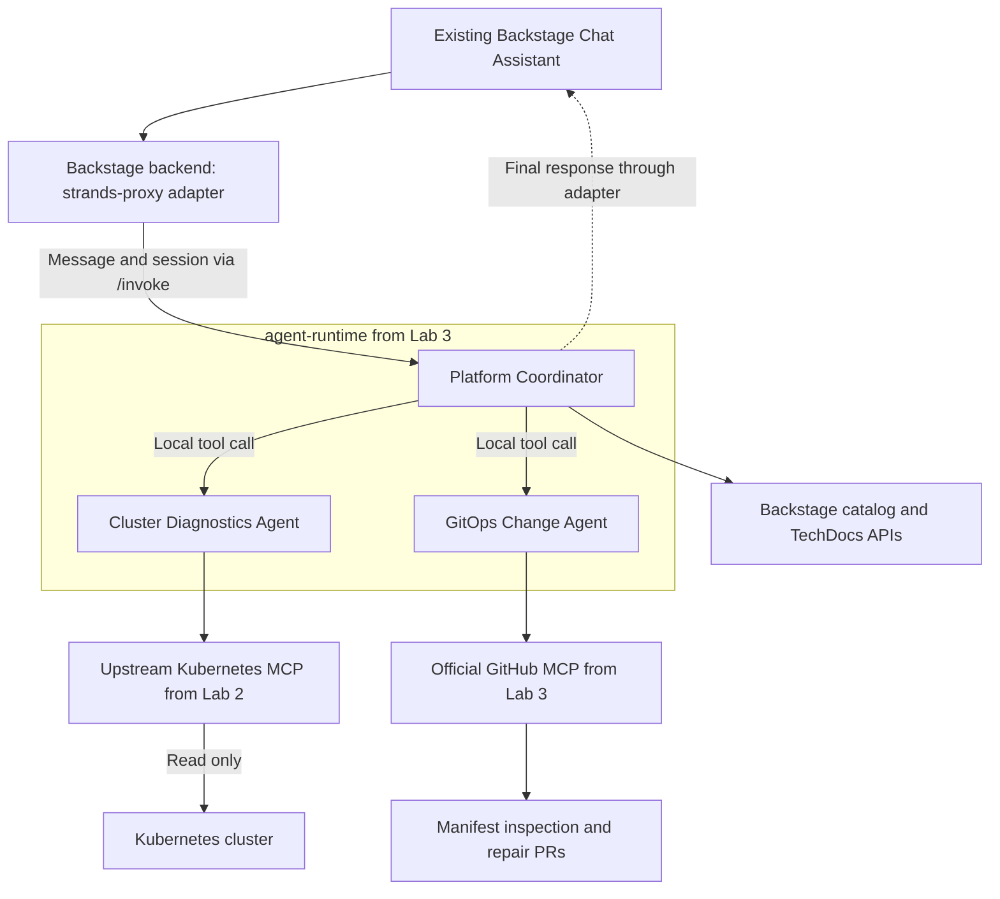

# Lab 4: Collaboration in the Existing Backstage Chat

Connect the coordinator to the existing Chapter 5 Backstage Chat Assistant. By the end, users will request diagnoses and repair PRs from the same chat UI, while the coordinator delegates to the specialists and returns their results.



The same chat now uses the coordinator and specialists. Cluster queries go through the upstream Kubernetes MCP; the old Chapter 5 custom Kubernetes actions are no longer used by this chat.

## Register the adapter

Set `BACKSTAGE_APP` to your existing Chapter 5 Backstage app:

```bash
export BACKSTAGE_APP=/absolute/path/to/my-backstage-app
```
Then copy the adapter:

```bash
: "${BOOK_REPO:?Set BOOK_REPO to your book repository}"
test -f "$BACKSTAGE_APP/packages/backend/src/index.ts" || { echo "Check BACKSTAGE_APP: backend index.ts was not found."; exit 1; }
mkdir -p "$BACKSTAGE_APP/packages/backend/src/modules"
cp "$BOOK_REPO/chapter-07/4-backstage-collaboration/files/strands-proxy-agent.ts" "$BACKSTAGE_APP/packages/backend/src/modules/strands-proxy-agent.ts"
```

Register the adapter in `$BACKSTAGE_APP/packages/backend/src/index.ts`. This command inserts it before `backend.start()` and skips it if already registered:

```bash
node <<'NODE'
const fs = require('node:fs');
const path = require('node:path');
const file = path.join(process.env.BACKSTAGE_APP, 'packages/backend/src/index.ts');
const source = fs.readFileSync(file, 'utf8');
const registration = "backend.add(import('./modules/strands-proxy-agent'));";
if (/backend\.add\(\s*import\(['"]\.\/modules\/strands-proxy-agent['"]\)\s*\)/.test(source)) {
  console.log('Adapter already registered.');
} else {
  const start = /^[ \t]*(?:await\s+)?backend\.start\(\);?/m;
  if (!start.test(source)) throw new Error('Could not find backend.start() in ' + file);
  fs.writeFileSync(file, source.replace(start, match => registration + '\n\n' + match));
  console.log('Adapter registered in ' + file);
}
NODE
```

The adapter forwards the message and session to `/invoke`. The coordinator owns the model loop. The chat receives a final response as a single chunk; live progress streaming is not implemented. Specialist execution is visible in logs and, in Lab 5, traces.

## Reconfigure the existing general agent

In `$BACKSTAGE_APP/app-config.yaml`, replace the existing `genai.agents.general` block with the `general` definition below. Keep other agents and settings; do not add a second `genai` section. If `app-config.local.yaml` also defines `general`, update that override too:

```yaml
genai:
  registerCoreActions: true
  agents:
    general:
      type: strands-proxy
      description: Platform assistant for application diagnosis and GitOps proposals
      prompt: Requests are handled by the platform coordinator.
      strands-proxy:
        url: http://localhost:18080
```

Keep the existing `assistant/general` route and Chat Assistant sidebar item. No new frontend component or route is required.

The old LangGraph `actions` list is no longer executed by this adapter. Cluster inspection now belongs to the diagnostics specialist. The coordinator's `catalog.py` preserves catalog and TechDocs search by calling the existing Backstage backend APIs. TechDocs must already be indexed for search results to appear.

## Authenticate catalog and documentation requests

The coordinator calls Backstage from a separate service. It needs its own Backstage token; the GitHub PAT and browser login do not authenticate these calls. Without it, catalog search returns `401 Unauthorized`.

In the terminal where you will restart Backstage, reuse the runtime's existing Secret or generate a token for the first run:

```bash
if kubectl -n agent-platform get secret agent-backstage-read >/dev/null 2>&1; then
  export BACKSTAGE_SERVICE_TOKEN="$(kubectl -n agent-platform get secret agent-backstage-read -o jsonpath='{.data.BACKSTAGE_SERVICE_TOKEN}' | base64 --decode)"
else
  export BACKSTAGE_SERVICE_TOKEN="$(openssl rand -hex 32)"
fi
: "${BACKSTAGE_SERVICE_TOKEN:?The Backstage service token is empty}"
kubectl -n agent-platform create secret generic agent-backstage-read \
  --from-literal=BACKSTAGE_SERVICE_TOKEN="$BACKSTAGE_SERVICE_TOKEN" \
  --dry-run=client -o yaml | kubectl apply -f -
```

Add this entry under the existing `backend.auth.externalAccess` in `$BACKSTAGE_APP/app-config.yaml`. Keep other backend settings and existing access entries. Store only the environment-variable reference in Git:

```yaml
backend:
  auth:
    externalAccess:
      - type: static
        options:
          token: ${BACKSTAGE_SERVICE_TOKEN}
          subject: platform-coordinator
        accessRestrictions:
          - plugin: catalog
          - plugin: search
```

These [Backstage service credentials](https://backstage.io/docs/auth/service-to-service-auth/) allow access to the catalog and search plugins. They represent the coordinator service; Chapter 8 adds user authorization.

The Lab 3 Deployment already references `agent-backstage-read` with `optional: true`. After creating the Secret, restart the runtime so the new pod loads the token:

```bash
kubectl -n agent-platform rollout restart deployment/agent-runtime
kubectl -n agent-platform rollout status deployment/agent-runtime --timeout=90s
```

## Restart and exercise the same conversation

Restart it for the new pod in a separate terminal:

```bash
kubectl -n agent-platform port-forward svc/agent-runtime 18080:80
```

Start the Backstage development process in the terminal you exported the `$BACKSTAGE_SERVICE_TOKEN`:

```bash
cd "$BACKSTAGE_APP"
NODE_OPTIONS=--no-node-snapshot yarn start
```


Open **Chat Assistant**, start a new conversation, and ask:

1. “Find my-first-app in the catalog.”
2. “Why is my-first-app failing? Inspect its live state.”
3. “Propose an image-repair PR if the evidence supports it.”

The coordinator selects specialists; the user remains in one chat. The final answer should distinguish observed facts, uncertainty, and an actual PR URL. No agent merges or applies the change.

If you merged the repair PR in Lab 3, the application should now be healthy and no further repair PR is needed.

Continue to [Lab 5: Observability](../5-langfuse-audit/README.md).
