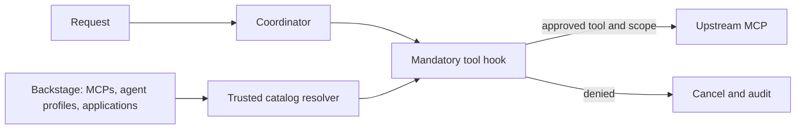

# Lab 1: Mandatory Guardrails and the Approved MCP Catalog

Register MCP servers and mandatory guardrail profiles in Backstage, create applications across two tenants and environments, and enforce approved tool access in the runtime. Reuse these applications for authorization, identity, and tenant-isolation exercises in Labs 2–4. Alice is a fixed demo identity until Lab 3.



## Understand the catalog and enforcement

`platform-security.yaml` registers two MCP servers, three guardrail profiles, and three agents. Each agent references a mandatory profile; the profile lists allowed tools and approved MCP connections. These are lab-specific catalog conventions, displayed as Resources in Backstage.

```bash
cat "$BOOK_REPO/chapter-08/1-guardrails-mcp-catalog/files/catalog/platform-security.yaml"
```

`security/catalog.py` loads these entries from the Backstage API. It accepts governance entries only from the configured repository's `platform-security.yaml`, and application entries from their reviewed `catalog-info.yaml`. It also checks MCP endpoints against the configured service addresses before a connection can send credentials.

```bash
cat "$BOOK_REPO/chapter-08/common/runtime/security/catalog.py"
```

`PolicyValidationHook` calls the authorization code before each tool executes. A denial cancels the call and records the decision. Catalog registration alone grants nothing; this hook makes the approved profile mandatory.

```bash
sed -n '/^class PolicyValidationHook/,$p' \
  "$BOOK_REPO/chapter-08/common/runtime/agent_runtime/hooks.py"
```

## Install the application template

Enter the application name, namespace, scaling settings, repository, tenant ID, and environment. These values describe the application; they do not grant the requester access to it.

Inspect the template's inputs and the values passed to `fetch:template`:

```bash
cat "$BOOK_REPO/chapter-08/1-guardrails-mcp-catalog/files/backstage/webapp-template/template.yaml"
```

The generated catalog descriptor records the selected namespace, tenant ID, environment, and Git manifest path for runtime authorization. Display only those relevant annotations:

```bash
sed -n '/annotations:/,/^spec:/p' \
  "$BOOK_REPO/chapter-08/1-guardrails-mcp-catalog/files/backstage/webapp-template/content/catalog-info.yaml"
```

Install these files into the Chapter 5 template directory:

```bash
if [ -z "${BACKSTAGE_APP:-}" ]; then
  echo "Set BACKSTAGE_APP as shown in the prerequisites."
elif [ ! -f "$BACKSTAGE_APP/examples/webapp-template/content/k8s/deployment.yaml" ]; then
  echo "Install the Chapter 5 template first."
else
  cp "$BOOK_REPO/chapter-08/1-guardrails-mcp-catalog/files/backstage/webapp-template/template.yaml" \
    "$BACKSTAGE_APP/examples/webapp-template/template.yaml"
  cp "$BOOK_REPO/chapter-08/1-guardrails-mcp-catalog/files/backstage/webapp-template/content/catalog-info.yaml" \
    "$BACKSTAGE_APP/examples/webapp-template/content/catalog-info.yaml"
fi
```

## Create the applications

Use these values for the exercises. Each application has a dedicated namespace; the Chapter 5 ApplicationSet expects the namespace to match the application directory name.

| Application | Namespace | Tenant ID | Environment |
|---|---|---|---|
| `logistics-demo` | `logistics-demo` | `tenant-a` | `dev` |
| `payments-demo` | `payments-demo` | `tenant-b` | `dev` |
| `logistics-prod` | `logistics-prod` | `tenant-a` | `production` |

Render all three applications from the same template. Existing directories are reported and skipped without closing your terminal:

```bash
while IFS='|' read -r app tenant environment description; do
  if [ -e "$COMPONENTS_REPO/$app" ]; then
    echo "$app already exists; reusing it."
    continue
  fi
  cp -R "$BOOK_REPO/chapter-08/1-guardrails-mcp-catalog/files/app-template" \
    "$COMPONENTS_REPO/$app"
  sed -i.bak \
    -e "s/APP_NAMESPACE/$app/g" \
    -e "s/APP_NAME/$app/g" \
    -e "s/TENANT_ID/$tenant/g" \
    -e "s/ENVIRONMENT/$environment/g" \
    -e "s/APP_DESCRIPTION/$description/g" \
    -e 's#APP_OWNER#user:guest#g' \
    -e 's/MIN_REPLICAS/2/g' \
    -e 's/MAX_REPLICAS/10/g' \
    -e 's/REPLICAS/2/g' \
    -e "s/GITHUB_USERNAME/$GITHUB_USERNAME/g" \
    -e 's/REPOSITORY_NAME/backstage-components/g' \
    "$COMPONENTS_REPO/$app/catalog-info.yaml" \
    "$COMPONENTS_REPO/$app/README.md" \
    "$COMPONENTS_REPO/$app/argocd/application.yaml" \
    "$COMPONENTS_REPO/$app/k8s/"*.yaml
  find "$COMPONENTS_REPO/$app" -name '*.bak' -delete
done <<'APPS'
logistics-demo|tenant-a|dev|Logistics demo application
payments-demo|tenant-b|dev|Payments demo application
logistics-prod|tenant-a|production|Production logistics application
APPS
```

You can also create the applications from **Create → Web App with Kubernetes Deployment** in Backstage using the values in the table.

Review the catalog entries before committing. Confirm that the tenants differ and each manifest path and namespace matches its application:

```bash
cat "$COMPONENTS_REPO/logistics-demo/catalog-info.yaml"
cat "$COMPONENTS_REPO/payments-demo/catalog-info.yaml"
cat "$COMPONENTS_REPO/logistics-prod/catalog-info.yaml"
```

The labs authorize a dedicated application namespace, including its pods, ReplicaSets, services, and events. Verify namespace ownership and security metadata during PR review. Production should also verify that the authenticated user may assign the requested tenant and environment.

## Prepare the catalog and runtime

Build the shared runtime with this lab's tag:

```bash
docker build --platform "$KIND_PLATFORM" -t agent-runtime:0.8.1 \
  "$BOOK_REPO/chapter-08/common/runtime"
docker image save --platform "$KIND_PLATFORM" -o /tmp/ch08-agent-0.8.1.tar agent-runtime:0.8.1
kind load image-archive /tmp/ch08-agent-0.8.1.tar --name agentic-platform
```

Copy the reviewed governance descriptors to the components repository:

```bash
cp "$BOOK_REPO/chapter-08/1-guardrails-mcp-catalog/files/catalog/platform-security.yaml" \
  "$COMPONENTS_REPO/platform-security.yaml"
```

Copy this lab's updated runtime Deployment into the GitOps repository. The Kubernetes and GitHub MCP manifests from Chapter 7 remain unchanged:

```bash
cp "$BOOK_REPO/chapter-08/1-guardrails-mcp-catalog/files/components-repo/agent-platform/k8s/deployment.yaml" \
  "$COMPONENTS_REPO/agent-platform/k8s/deployment.yaml"
sed -i.bak "s/YOUR_USERNAME/$GITHUB_USERNAME/g" \
  "$COMPONENTS_REPO/agent-platform/k8s/deployment.yaml"
rm "$COMPONENTS_REPO/agent-platform/k8s/deployment.yaml.bak"
```

Review the Deployment and retain your model-provider settings, repository name/default branch, and Backstage URL. Then create a branch, review and commit the changes, and open and merge the pull request:

```bash
git -C "$COMPONENTS_REPO" checkout -b chapter-08/lab-1-guardrails
git -C "$COMPONENTS_REPO" status --short
git --no-pager -C "$COMPONENTS_REPO" diff -- agent-platform/k8s/ platform-security.yaml logistics-demo/ payments-demo/ logistics-prod/
git -C "$COMPONENTS_REPO" add agent-platform/k8s/ platform-security.yaml logistics-demo/ payments-demo/ logistics-prod/
git -C "$COMPONENTS_REPO" commit -m "chapter 8 lab 1: guardrails"
git -C "$COMPONENTS_REPO" push -u origin HEAD
(cd "$COMPONENTS_REPO" && gh pr create --fill)
(cd "$COMPONENTS_REPO" && GH_PAGER=cat gh pr view)
(cd "$COMPONENTS_REPO" && GH_PAGER=cat gh pr diff)
(cd "$COMPONENTS_REPO" && gh pr merge --merge --delete-branch)
```

## Register the governance entries in Backstage

Chapter 5 already configured `*/catalog-info.yaml`, so Backstage discovers both new applications automatically. Add only the governance file to the existing `catalog.locations` array in `$BACKSTAGE_APP/app-config.yaml`. This guarded command preserves the wildcard entry and is safe to run again:

```bash
if ! grep -q 'platform-security.yaml' "$BACKSTAGE_APP/app-config.yaml"; then
  sed -i.bak "/# Local example data/i\\
    # Chapter 8 security governance profiles\\
    - type: url\\
      target: https://github.com/$GITHUB_USERNAME/backstage-components/blob/main/platform-security.yaml\\
      rules:\\
        - allow: [Resource]\\
" "$BACKSTAGE_APP/app-config.yaml"
  rm "$BACKSTAGE_APP/app-config.yaml.bak"
fi
```


Restart Backstage from its terminal, retaining the credentials used in Chapter 7:

```bash
cd "$BACKSTAGE_APP"
NODE_OPTIONS=--no-node-snapshot yarn start
```

Open the Backstage catalog and inspect the application annotations, approved MCP servers, and mandatory guardrail profiles. If an entity is not found, wait for catalog processing and refresh the page:

- [All Components](http://localhost:3000/catalog?filters%5Bkind%5D=component)
- [All Resources](http://localhost:3000/catalog?filters%5Bkind%5D=resource)

The diagnostics agent uses only the approved Kubernetes MCP, the GitOps agent uses only the approved GitHub MCP, and the coordinator has no direct MCP connection.

Profiles and security annotations must be reviewed by the platform owner. Protect `platform-security.yaml` and application `catalog-info.yaml` files with required reviews; catalog `spec.owner` alone is not an authorization grant. See [Backstage entity descriptors](https://backstage.io/docs/features/software-catalog/descriptor-format/) and [managed location annotations](https://backstage.io/docs/features/software-catalog/well-known-annotations/).

Ask the ApplicationSet to discover the new application directories:

```bash
kubectl -n argocd annotate applicationset backstage-app-discovery \
  argocd.argoproj.io/application-set-refresh=true --overwrite
```

Refresh ArgoCD and wait for this lab's image before checking readiness:

```bash
kubectl -n argocd annotate application agent-platform \
  argocd.argoproj.io/refresh=hard --overwrite
kubectl -n agent-platform wait --for=jsonpath='{.spec.template.spec.containers[0].image}'=agent-runtime:0.8.1 \
  deployment/agent-runtime --timeout=180s
kubectl -n agent-platform rollout status deployment/agent-runtime --timeout=360s
```

If Backstage is temporarily unavailable, the runtime remains alive but not ready and retries every five seconds. Follow its progress in another terminal:

```bash
kubectl -n agent-platform logs deployment/agent-runtime --follow
```

The log reports `dependencies not ready` while retrying and `dependencies ready` after the catalog and approved MCP connections load.

Check that both application Deployments have been created. If either is not found yet, wait for ArgoCD reconciliation and repeat this check:

```bash
kubectl -n logistics-demo get deployment logistics-demo
kubectl -n payments-demo get deployment payments-demo
kubectl -n logistics-prod get deployment logistics-prod
```

## Test the MCP allowlist

First, test the agent-to-MCP assignments without relying on the model to select a tool. The diagnostics and GitOps agents should reach only their assigned MCP servers; cross-agent access and an MCP absent from the catalog should be denied.

```bash
kubectl -n agent-platform exec -i deploy/agent-runtime -- python - <<'PYCODE'
from security.catalog import BackstageCatalog
from security.identity import AccessDenied
from security.policy import Policy

catalog = BackstageCatalog()
policy = Policy(catalog)
try:
    for actor, server in [
        ('diagnostics', 'kubernetes'),
        ('gitops', 'github'),
        ('diagnostics', 'github'),
        ('gitops', 'kubernetes'),
        ('diagnostics', 'filesystem'),
    ]:
        try:
            policy.approved_mcp(actor, server)
            print(f'{actor} -> {server}: ALLOW')
        except AccessDenied as error:
            print(f'{actor} -> {server}: DENY: {error}')

finally:
    policy.client.close()
    catalog.client.close()
PYCODE
```

Expect the assigned Kubernetes and GitHub connections to return **ALLOW**. Cross-agent connections and the filesystem MCP return **DENY: mcp_server_not_approved**.

Next, evaluate a Kubernetes read and write against the diagnostics guardrail. This calls the actual policy code but does not execute either MCP tool or modify the cluster:

```bash
kubectl -n agent-platform exec -i deploy/agent-runtime -- python - <<'PYCODE'
from security.catalog import BackstageCatalog
from security.identity import ALICE, AccessDenied
from security.policy import Policy

catalog = BackstageCatalog()
policy = Policy(catalog)
try:
    for label, tool, arguments in [
        ('Kubernetes read', 'resources_list', {
            'apiVersion': 'apps/v1',
            'kind': 'Deployment',
            'namespace': 'logistics-demo',
        }),
        ('Kubernetes write', 'resources_create_or_update', {
            'resource': 'apiVersion: v1\nkind: ConfigMap\nmetadata:\n  name: denied',
        }),
    ]:
        try:
            policy.authorize(ALICE, tool, arguments,
                             actor='diagnostics', application='logistics-demo')
            print(f'{label}: ALLOW')
        except AccessDenied as error:
            print(f'{label}: DENY: {error}')
finally:
    policy.client.close()
    catalog.client.close()
PYCODE
```

Expect **Kubernetes read: ALLOW** and **Kubernetes write: DENY: unknown_tool**. The write tool is not part of the runtime's accepted tool set.

Confirm the second enforcement layer. The Kubernetes MCP service account can read Deployments but cannot create them:

```bash
kubectl auth can-i get deployments \
  --as=system:serviceaccount:agent-platform:cluster-mcp \
  -n logistics-demo
kubectl auth can-i create deployments \
  --as=system:serviceaccount:agent-platform:cluster-mcp \
  -n logistics-demo
```

Expect **yes** followed by **no**. Even if a Kubernetes write tool were exposed accidentally, Kubernetes RBAC would still reject the operation.

The same checks run before every MCP-backed tool call. Profiles refresh on every invocation; a missing or untrusted profile and a Backstage outage both fail closed.

At this point, you have verified that Backstage supplies the reviewed MCP and guardrail definitions, the runtime accepts only assigned connections and read-only Kubernetes tools, and RBAC independently blocks cluster writes. Lab 2 adds OPA decisions for the requesting user's role and action.

Continue to [Lab 2: OPA authorization](../2-opa-authorization/README.md).
