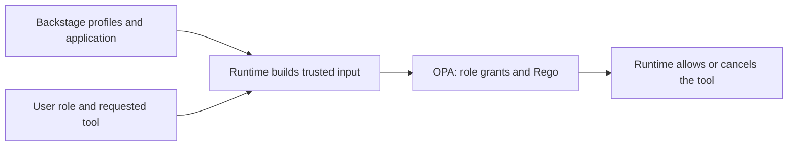

# Lab 2: OPA Authorization

Lab 1 defined which capabilities the platform and each agent may use. This lab goes one level deeper: Open Policy Agent decides whether the requesting user's role may use an approved capability for a specific application and environment. OPA can narrow the permissions established in Lab 1, but it cannot grant a rejected tool or MCP connection.

Alice remains a fixed demo identity while you compare role-based decisions; Lab 3 replaces this predefined identity with a signed user identity. MCP profiles and application metadata continue to come from Backstage.



## Read the authorization rules

`roles.yaml` contains role grants. A viewer can read production resources but cannot propose changes; a platform engineer can read and propose changes in development and staging.
```bash
cat "$BOOK_REPO/chapter-08/2-opa-authorization/files/policies/roles.yaml"
```

The Rego policy defaults to denial. It combines these role grants with the verified runtime input: the acting agent's profile, application metadata, requested tool, and arguments. Lab 4 later adds a separate tenant rule.

```bash
cat "$BOOK_REPO/chapter-08/2-opa-authorization/files/policies/agent-tool-validation.rego"
```

## Deploy OPA

Build the shared runtime with this lab's tag and save the image for the cluster's architecture, then load it into kind:


```bash
docker build --platform "$KIND_PLATFORM" -t agent-runtime:0.8.2 \
  "$BOOK_REPO/chapter-08/common/runtime"

docker image save --platform "$KIND_PLATFORM" -o /tmp/ch08-agent-0.8.2.tar agent-runtime:0.8.2
kind load image-archive /tmp/ch08-agent-0.8.2.tar --name agentic-platform
```

Render the OPA ConfigMap locally. `system-authz.rego` restricts OPA's HTTP API to health and decision requests, preventing clients from overwriting policy through that API:

```bash
kubectl create configmap agent-policies -n agent-platform \
  --from-file=roles.yaml="$BOOK_REPO/chapter-08/2-opa-authorization/files/policies/roles.yaml" \
  --from-file=agent-tool-validation.rego="$BOOK_REPO/chapter-08/2-opa-authorization/files/policies/agent-tool-validation.rego" \
  --from-file=system-authz.rego="$BOOK_REPO/chapter-08/2-opa-authorization/files/policies/system-authz.rego" \
  --dry-run=client -o yaml > "$COMPONENTS_REPO/agent-platform/k8s/configmap-agent-policies.yaml"
```

Copy this lab's manifests into the GitOps repository, fill in the repository owner, and set the policy hash. The hash changes the OPA pod template whenever a policy file changes, causing Kubernetes to load the new policy:

```bash
cp "$BOOK_REPO/chapter-08/2-opa-authorization/files/components-repo/agent-platform/k8s/"*.yaml \
  "$COMPONENTS_REPO/agent-platform/k8s/"
sed -i.bak "s/YOUR_USERNAME/$GITHUB_USERNAME/g" \
  "$COMPONENTS_REPO/agent-platform/k8s/deployment.yaml" && \
  rm "$COMPONENTS_REPO/agent-platform/k8s/deployment.yaml.bak"
POLICY_HASH=$(cat "$BOOK_REPO/chapter-08/2-opa-authorization/files/policies/"* \
  | shasum -a 256 | cut -d ' ' -f 1)
sed -i.bak "s/chapter08\/policy-hash:.*/chapter08\/policy-hash: $POLICY_HASH/" \
  "$COMPONENTS_REPO/agent-platform/k8s/opa-deployment.yaml" && \
  rm "$COMPONENTS_REPO/agent-platform/k8s/opa-deployment.yaml.bak"
```

Review the Deployment and retain your model-provider settings, repository name/default branch, and Backstage URL.

Create a branch, inspect and commit the local changes, and open and merge the pull request:

```bash
git -C "$COMPONENTS_REPO" checkout -b chapter-08/lab-2-opa
git -C "$COMPONENTS_REPO" status --short
git --no-pager -C "$COMPONENTS_REPO" diff -- agent-platform/k8s/
git -C "$COMPONENTS_REPO" add agent-platform/k8s/
git -C "$COMPONENTS_REPO" commit -m "chapter 8 lab 2: opa"
git -C "$COMPONENTS_REPO" push -u origin HEAD
(cd "$COMPONENTS_REPO" && gh pr create --fill)
(cd "$COMPONENTS_REPO" && gh pr merge --merge --delete-branch)
```

Refresh ArgoCD and wait for this lab's image before checking readiness:

```bash
kubectl -n argocd annotate application agent-platform \
  argocd.argoproj.io/refresh=hard --overwrite
kubectl -n agent-platform wait --for=jsonpath='{.spec.template.spec.containers[0].image}'=agent-runtime:0.8.2 \
  deployment/agent-runtime --timeout=180s
kubectl -n agent-platform rollout status deployment/agent-runtime --timeout=360s
```

Wait for OPA before evaluating decisions:

```bash
kubectl -n agent-platform rollout status deployment/opa-policy-engine --timeout=180s
```

## Evaluate without the model

This command runs the actual authorization client inside the runtime pod. It resolves `logistics-demo` from Backstage and calls OPA with Alice's claims, then a predefined viewer identity. No model runs and no Git or Kubernetes workload tool executes.

```bash
kubectl -n agent-platform exec -i deploy/agent-runtime -- python - <<'PYCODE'
from dataclasses import replace
from security.catalog import BackstageCatalog
from security.identity import ALICE, AccessDenied
from security.policy import Policy
catalog = BackstageCatalog()
policy = Policy(catalog)
viewer = replace(ALICE, role='viewer')
try:
    for label, user, action in [
        ('Alice: diagnose', ALICE, 'diagnose_application'),
        ('Alice: propose PR', ALICE, 'propose_change'),
        ('Viewer: diagnose', viewer, 'diagnose_application'),
        ('Viewer: propose PR', viewer, 'propose_change'),
    ]:
        try:
            policy.authorize(user, action, {'application': 'logistics-demo'}, actor='coordinator')
            print(label, 'ALLOW')
        except AccessDenied as error:
            print(label, 'DENY:', error)
finally:
    policy.client.close()
    catalog.client.close()
PYCODE
```

Expect **ALLOW, ALLOW, ALLOW, DENY** for a development application. The last decision demonstrates that knowing the application and using an approved agent is insufficient: the user's role must permit the action. A policy outage or invalid response also blocks execution.

Now isolate the role-and-environment rule. This policy-only check starts with the trusted `logistics-demo` target and evaluates synthetic copies marked as `dev`, `staging`, and `production`. It demonstrates the permission matrix without registering fake applications or executing a tool:

```bash
kubectl -n agent-platform exec -i deploy/agent-runtime -- python - <<'PYCODE'
from dataclasses import replace

from security.catalog import BackstageCatalog
from security.identity import ALICE
from security.policy import Policy

catalog = BackstageCatalog()
policy = Policy(catalog)
target = policy.application('logistics-demo')
try:
    for role in ['viewer', 'developer', 'platform-engineer', 'release-engineer']:
        user = replace(ALICE, role=role)
        for environment in ['dev', 'staging', 'production']:
            decision = policy.client.post(
                f'{policy.url}/v1/data/agent/tool_validation/decision',
                json={'input': {
                    'actor': 'coordinator',
                    'schema_version': 1,
                    'identity': user.document(),
                    'tool': 'propose_change',
                    'arguments': {'application': 'logistics-demo'},
                    'target': {**target, 'environment': environment},
                    'mcp_server': None,
                    'guardrails': policy.registry,
                    'repository': {'owner': '', 'name': '', 'default_branch': 'main'},
                    'policy_revision': policy.registry['revision'],
                    'memory_enabled': False,
                }},
            ).json()['result']
            outcome = 'ALLOW' if decision['allow'] else 'DENY'
            print(f'{role:18} {environment:10} {outcome}')
finally:
    policy.client.close()
    catalog.client.close()
PYCODE
```

The viewer is denied in every environment; the developer is allowed only in `dev`; the platform engineer is allowed in `dev` and `staging`; and the release engineer is allowed in all three. Lab 3 verifies the user's role, and Lab 4 adds tenant isolation.

The runtime constructs OPA input from trusted catalog data and identity, not from arbitrary `/invoke` fields. Direct calls to OPA are decisions only; they cannot execute an MCP tool. Every allowed change still ends in a PR for human review.

Continue to [Lab 3: Verified identity](../3-verified-identity/README.md).
