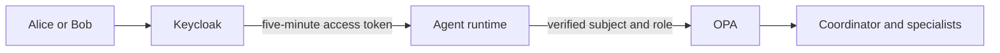

# Lab 3: Verified User Identity

Deploy a local Keycloak identity provider and replace Lab 2's predefined Alice identity with short-lived access tokens for Alice and Bob. Keycloak authenticates each user and supplies one role. The runtime validates that identity before passing the role to OPA, where it determines the permitted actions and environments. Lab 4 adds tenant membership as a separate authorization dimension.



## Configure the identities

The realm defines the standard OIDC `profile` and `email` scopes required by Backstage, the platform-specific `agent.invoke` scope, and two users. Alice receives the `platform-engineer` role and Bob receives the `developer` role:

```bash
cat "$BOOK_REPO/chapter-08/3-verified-identity/files/keycloak/platform-realm.json"
```

Generate local lab passwords. The template contains placeholders, and the rendered realm is stored directly as a Kubernetes Secret instead of being committed to either repository:

```bash
export ALICE_PASSWORD="$(openssl rand -hex 16)"
export BOB_PASSWORD="$(openssl rand -hex 16)"
export BACKSTAGE_OIDC_CLIENT_SECRET="$(openssl rand -hex 32)"
export BACKSTAGE_AUTH_SESSION_SECRET="$(openssl rand -hex 32)"

sed -e "s/ALICE_PASSWORD/$ALICE_PASSWORD/g" \
  -e "s/BOB_PASSWORD/$BOB_PASSWORD/g" \
  -e "s/BACKSTAGE_OIDC_CLIENT_SECRET/$BACKSTAGE_OIDC_CLIENT_SECRET/g" \
  "$BOOK_REPO/chapter-08/3-verified-identity/files/keycloak/platform-realm.json" \
  > /tmp/ch08-platform-realm.json
kubectl -n agent-platform create secret generic keycloak-realm-import \
  --from-file=platform-realm.json=/tmp/ch08-platform-realm.json \
  --dry-run=client -o yaml \
  | kubectl apply -f -
rm /tmp/ch08-platform-realm.json
```

> [!IMPORTANT]
> **Lab shortcut:** These generated passwords and the password grant are only for this local exercise.
>
> **Production:** Use a durable database, TLS, managed credentials, MFA, and an authorization-code flow. Disable the password grant.

## Deploy Keycloak and the runtime

Pull the pinned Keycloak image for the kind node architecture, save it as a single-platform archive, and load it into kind:

```bash
docker pull --platform "$KIND_PLATFORM" quay.io/keycloak/keycloak:26.7.4
docker image save --platform "$KIND_PLATFORM" \
  -o /tmp/ch08-keycloak-26.7.4.tar quay.io/keycloak/keycloak:26.7.4
kind load image-archive /tmp/ch08-keycloak-26.7.4.tar --name agentic-platform
```

Build and load the runtime for this lab:

```bash
docker build --platform "$KIND_PLATFORM" -t agent-runtime:0.8.3 \
  "$BOOK_REPO/chapter-08/common/runtime"
docker image save --platform "$KIND_PLATFORM" \
  -o /tmp/ch08-agent-0.8.3.tar agent-runtime:0.8.3
kind load image-archive /tmp/ch08-agent-0.8.3.tar --name agentic-platform
```

Copy the Keycloak and runtime manifests into the GitOps repository and fill in the GitHub owner:

```bash
cp "$BOOK_REPO/chapter-08/3-verified-identity/files/components-repo/agent-platform/k8s/"*.yaml \
  "$COMPONENTS_REPO/agent-platform/k8s/"
sed -i.bak "s/YOUR_USERNAME/$GITHUB_USERNAME/g" \
  "$COMPONENTS_REPO/agent-platform/k8s/deployment.yaml"
rm "$COMPONENTS_REPO/agent-platform/k8s/deployment.yaml.bak"
```

The Keycloak Deployment imports the realm from the Secret. The runtime reads Keycloak's JWKS endpoint to verify signatures and pins the expected issuer and audience. Review the runtime Deployment and retain your model-provider settings, repository name/default branch, and Backstage URL.

Commit the manifests and merge them through a pull request:

```bash
git -C "$COMPONENTS_REPO" checkout -b chapter-08/lab-3-identity
git -C "$COMPONENTS_REPO" status --short
git --no-pager -C "$COMPONENTS_REPO" diff -- agent-platform/k8s/
git -C "$COMPONENTS_REPO" add agent-platform/k8s/
git -C "$COMPONENTS_REPO" commit -m "chapter 8 lab 3: verified identity"
git -C "$COMPONENTS_REPO" push -u origin HEAD
(cd "$COMPONENTS_REPO" && gh pr create --fill)
(cd "$COMPONENTS_REPO" && gh pr merge --merge --delete-branch)
```

Refresh ArgoCD, then wait for Keycloak and the new runtime:

```bash
kubectl -n argocd annotate application agent-platform \
  argocd.argoproj.io/refresh=hard --overwrite
kubectl -n agent-platform rollout status deployment/keycloak --timeout=360s
kubectl -n agent-platform wait \
  --for=jsonpath='{.spec.template.spec.containers[0].image}'=agent-runtime:0.8.3 \
  deployment/agent-runtime --timeout=180s
kubectl -n agent-platform rollout status deployment/agent-runtime --timeout=360s
```

<details>
<summary>Keycloak failed while importing an earlier realm configuration</summary>

After recreating `keycloak-realm-import` with the corrected configuration, restart Keycloak and watch the import:

```bash
kubectl -n agent-platform rollout restart deployment/keycloak
kubectl -n agent-platform rollout status deployment/keycloak --timeout=360s
kubectl -n agent-platform logs deployment/keycloak --tail=100
```

</details>

## Request and inspect an access token

Leave both port-forwards running in separate terminals:

```bash
kubectl -n agent-platform port-forward svc/keycloak 18083:8080
```

```bash
kubectl -n agent-platform port-forward svc/agent-runtime 18080:80
```

Request Alice's five-minute access token from Keycloak. Keep the response briefly so an authentication error remains visible instead of being hidden by command substitution. Display only non-sensitive metadata; do not print the bearer token. The password grant keeps this local CLI exercise short; a production Backstage integration uses browser-based OIDC instead:

```bash
ALICE_TOKEN_RESPONSE="$(curl --fail-with-body -sS \
  http://localhost:18083/realms/platform/protocol/openid-connect/token \
  -H 'Content-Type: application/x-www-form-urlencoded' \
  --data-urlencode grant_type=password \
  --data-urlencode client_id=agent-platform \
  --data-urlencode username=alice \
  --data-urlencode password="$ALICE_PASSWORD")"
printf '%s\n' "$ALICE_TOKEN_RESPONSE" | jq '{token_type, expires_in, scope}'
export ALICE_TOKEN="$(printf '%s' "$ALICE_TOKEN_RESPONSE" | jq -er .access_token)"
```

Decode the payload locally and verify the claims used by the security boundary:

```bash
printf '%s' "$ALICE_TOKEN" | cut -d. -f2 \
  | jq -Rr '@base64d | fromjson | {sub, preferred_username, aud, azp, scope, roles, exp}'
```

The token contains `roles: ["platform-engineer"]`. The runtime requires exactly one role, while OPA reads `roles.yaml` to determine which actions and environments that role permits.

## Verify authenticated requests

Use Alice's token for an authenticated diagnosis:

```bash
curl --fail-with-body http://localhost:18080/invoke \
  -H "Authorization: Bearer $ALICE_TOKEN" \
  -H 'Content-Type: application/json' \
  -d '{"intent":"Inspect logistics-demo and report its live status.","session_id":"ch08-lab3-alice"}'
```

Repeat without a token. Expect **401** before the model or any MCP tool executes:

```bash
curl -i http://localhost:18080/invoke \
  -H 'Content-Type: application/json' \
  -d '{"intent":"Inspect logistics-demo.","session_id":"ch08-no-token"}'
```

Request Bob's token and use it to inspect his demo workload:

```bash
BOB_TOKEN_RESPONSE="$(curl --fail-with-body -sS \
  http://localhost:18083/realms/platform/protocol/openid-connect/token \
  -H 'Content-Type: application/x-www-form-urlencoded' \
  --data-urlencode grant_type=password \
  --data-urlencode client_id=agent-platform \
  --data-urlencode username=bob \
  --data-urlencode password="$BOB_PASSWORD")"
printf '%s\n' "$BOB_TOKEN_RESPONSE" | jq '{token_type, expires_in, scope}'
export BOB_TOKEN="$(printf '%s' "$BOB_TOKEN_RESPONSE" | jq -er .access_token)"

curl --fail-with-body http://localhost:18080/invoke \
  -H "Authorization: Bearer $BOB_TOKEN" \
  -H 'Content-Type: application/json' \
  -d '{"intent":"Inspect payments-demo and report its live status.","session_id":"ch08-lab3-bob"}'
```

Keycloak proves who the user is and supplies the verified role. The runtime validates it, and OPA decides whether that role may perform the requested action in the target environment. Tokens expire after five minutes; repeat the corresponding token request when needed.

Use Alice's valid token against the production application:

```bash
curl --fail-with-body http://localhost:18080/invoke \
  -H "Authorization: Bearer $ALICE_TOKEN" \
  -H 'Content-Type: application/json' \
  -d '{"intent":"Inspect logistics-prod and report its live status.","session_id":"ch08-lab3-production-deny"}'
```

Alice authenticates successfully, but OPA denies the diagnostic because `platform-engineer` is limited to `dev` and `staging`. The mandatory hook stops the Kubernetes MCP call. A `release-engineer` role would be required for production access.

## Send a verified request from Backstage

The command-line calls prove the runtime validates Keycloak tokens. Now connect the same authorization-code flow to Backstage. The browser signs in as Alice or Bob, obtains that user's short-lived Keycloak access token, and sends it through an authenticated Backstage backend route to the runtime. The backend forwards the token; it does not select or impersonate a demo user.

Install the pinned generic OIDC provider and the dependencies used by the small backend route:

```bash
cd "$BACKSTAGE_APP"
yarn workspace backend add \
  @backstage/plugin-auth-backend-module-oidc-provider@0.4.13 \
  express@4.21.2
yarn workspace backend add --dev @types/express@4.17.23
```

Copy the OIDC API, verified-request page, backend proxy, and the two catalog users into the existing Backstage app:

```bash
mkdir -p "$BACKSTAGE_APP/packages/app/src/components/SecureAgentPage"
cp "$BOOK_REPO/chapter-08/3-verified-identity/files/backstage/oidc.ts" \
  "$BACKSTAGE_APP/packages/app/src/oidc.ts"
cp "$BOOK_REPO/chapter-08/3-verified-identity/files/backstage/SecureAgentPage.tsx" \
  "$BACKSTAGE_APP/packages/app/src/components/SecureAgentPage/index.tsx"
cp "$BOOK_REPO/chapter-08/3-verified-identity/files/backstage/secure-agent-proxy.ts" \
  "$BACKSTAGE_APP/packages/backend/src/modules/secure-agent-proxy.ts"

grep -q 'name: alice' "$BACKSTAGE_APP/examples/org.yaml" || \
  cat "$BOOK_REPO/chapter-08/3-verified-identity/files/backstage/users.yaml" \
  >> "$BACKSTAGE_APP/examples/org.yaml"
```

Register the frontend API, sign-in provider, page route, OIDC backend provider, and secure proxy. Each change is skipped if it is already present, so the block can be run again safely:

```bash
grep -q "oidcApiFactory" "$BACKSTAGE_APP/packages/app/src/apis.ts" || sed -i.bak \
  -e "1i\\
import { oidcApiFactory } from './oidc';" \
  -e "/export const apis: AnyApiFactory\[\] = \[/a\\
  oidcApiFactory," \
  "$BACKSTAGE_APP/packages/app/src/apis.ts"

grep -q "oidcAuthApiRef" "$BACKSTAGE_APP/packages/app/src/App.tsx" || sed -i.bak \
  -e "1i\\
import { oidcAuthApiRef } from './oidc';\\
import { SecureAgentPage } from './components/SecureAgentPage';" \
  -e "s#SignInPage: props => <SignInPage {...props} auto providers={\['guest'\]} />,#SignInPage: props => (\\
      <SignInPage\\
        {...props}\\
        auto\\
        providers={[{\\
          id: 'oidc',\\
          title: 'Keycloak',\\
          message: 'Sign in with the Chapter 8 identity provider',\\
          apiRef: oidcAuthApiRef,\\
        }]}\\
      />\\
    ),#" \
  "$BACKSTAGE_APP/packages/app/src/App.tsx"

# Use the verified interface for the existing general-assistant URL. The
# dynamic route remains available for any other configured assistants.
sed -i.bak \
  -e '/path="\/assistant\/general"/d' \
  -e '/<Route path="\/assistant\/:agentName"/i\\
    <Route path="/assistant/general" element={<SecureAgentPage />} />' \
  "$BACKSTAGE_APP/packages/app/src/App.tsx"

grep -q "plugin-auth-backend-module-oidc-provider" \
  "$BACKSTAGE_APP/packages/backend/src/index.ts" || sed -i.bak \
  "/backend.add(import('@backstage\/plugin-auth-backend'));/a\\
backend.add(import('@backstage/plugin-auth-backend-module-oidc-provider'));" \
  "$BACKSTAGE_APP/packages/backend/src/index.ts"

grep -q "modules/secure-agent-proxy" \
  "$BACKSTAGE_APP/packages/backend/src/index.ts" || sed -i.bak \
  "/backend.start();/i\\
backend.add(import('./modules/secure-agent-proxy'));\\
" "$BACKSTAGE_APP/packages/backend/src/index.ts"

find "$BACKSTAGE_APP/packages" -name '*.bak' -delete
```

Keep the lab settings in a separate config file. It adds OIDC and the secure runtime URL without replacing the existing catalog locations that supply applications and governance profiles:

```bash
cp "$BOOK_REPO/chapter-08/3-verified-identity/files/backstage/config.example.yaml" \
  "$BACKSTAGE_APP/app-config.chapter08.yaml"
```

Keep the Keycloak and runtime port-forwards running. The session secret lets Backstage preserve the OIDC authorization-code flow between the sign-in request and callback. Generate it here if this terminal did not run the earlier exports, then start Backstage:

```bash
export BACKSTAGE_OIDC_CLIENT_SECRET
export BACKSTAGE_AUTH_SESSION_SECRET="${BACKSTAGE_AUTH_SESSION_SECRET:-$(openssl rand -hex 32)}"

printf 'Keycloak lab users:\n  username: alice\n  password: %s\n  username: bob\n  password: %s\n' \
  "$ALICE_PASSWORD" "$BOB_PASSWORD"

cd "$BACKSTAGE_APP"
NODE_OPTIONS=--no-node-snapshot yarn start \
  --config "$BACKSTAGE_APP/app-config.yaml" \
  --config "$BACKSTAGE_APP/app-config.local.yaml" \
  --config "$BACKSTAGE_APP/app-config.chapter08.yaml"
```

Open [http://localhost:3000/assistant/general](http://localhost:3000/assistant/general), sign in as Alice, and ask `Inspect logistics-demo and report its live status.` The request succeeds with Alice's verified subject and role. Then ask the same question about `logistics-prod`; OPA denies production access even though the same user authenticated successfully. The browser and backend keep the bearer token out of the prompt and logs.

Continue to [Lab 4: Tenant isolation](../4-tenant-isolation/README.md).
