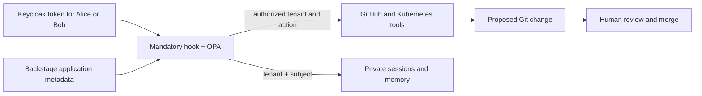

# Lab 4: Tenant Isolation

Apply the verified Keycloak identity to application access, catalog results, sessions, and memory. Alice can use tenant A resources and Bob can use tenant B resources. Backstage supplies reviewed tenant and environment metadata; OPA compares the tenant with the verified claim and derives environment permissions from the verified role.



## Enable tenant isolation

Lab 3's tokens contain no tenant. This lab adds a `tenant_id` mapper and assigns exactly one tenant to each Keycloak user. The jq filter makes that change explicit:

```bash
cat "$BOOK_REPO/chapter-08/4-tenant-isolation/files/keycloak/add-tenant-claim.jq"
```

Render the updated realm with the existing lab passwords and replace the Kubernetes Secret:

```bash
sed -e "s/ALICE_PASSWORD/$ALICE_PASSWORD/g" \
  -e "s/BOB_PASSWORD/$BOB_PASSWORD/g" \
  -e "s/BACKSTAGE_OIDC_CLIENT_SECRET/$BACKSTAGE_OIDC_CLIENT_SECRET/g" \
  "$BOOK_REPO/chapter-08/3-verified-identity/files/keycloak/platform-realm.json" \
  | jq -f "$BOOK_REPO/chapter-08/4-tenant-isolation/files/keycloak/add-tenant-claim.jq" \
  > /tmp/ch08-platform-realm.json
kubectl -n agent-platform create secret generic keycloak-realm-import \
  --from-file=platform-realm.json=/tmp/ch08-platform-realm.json \
  --dry-run=client -o yaml \
  | kubectl apply -f -
rm /tmp/ch08-platform-realm.json

kubectl -n agent-platform rollout restart deployment/keycloak
kubectl -n agent-platform rollout status deployment/keycloak --timeout=360s
```

The local Keycloak deployment uses ephemeral development storage, so the replacement pod imports the updated realm. A production realm would add the user attribute and protocol mapper through reviewed identity-provider configuration instead.

Lab 4 adds its tenant-aware identity validator as a small layer over the Lab 3 image. Build it with this lab's tag:

```bash
docker build --platform "$KIND_PLATFORM" -t agent-runtime:0.8.4 \
  "$BOOK_REPO/chapter-08/4-tenant-isolation/files/runtime"

docker image save --platform "$KIND_PLATFORM" -o /tmp/ch08-agent-0.8.4.tar agent-runtime:0.8.4
kind load image-archive /tmp/ch08-agent-0.8.4.tar --name agentic-platform
```
Render the OPA ConfigMap again, this time including Lab 4's tenant rule:

```bash
kubectl create configmap agent-policies -n agent-platform \
  --from-file=roles.yaml="$BOOK_REPO/chapter-08/2-opa-authorization/files/policies/roles.yaml" \
  --from-file=agent-tool-validation.rego="$BOOK_REPO/chapter-08/2-opa-authorization/files/policies/agent-tool-validation.rego" \
  --from-file=system-authz.rego="$BOOK_REPO/chapter-08/2-opa-authorization/files/policies/system-authz.rego" \
  --from-file=tenant-isolation.rego="$BOOK_REPO/chapter-08/4-tenant-isolation/files/policies/tenant-isolation.rego" \
  --dry-run=client -o yaml > "$COMPONENTS_REPO/agent-platform/k8s/configmap-agent-policies.yaml"
```

Copy this lab's runtime and OPA manifests into the GitOps repository, fill in the GitHub owner, and update the OPA policy hash:

```bash
cp "$BOOK_REPO/chapter-08/4-tenant-isolation/files/components-repo/agent-platform/k8s/"*.yaml \
  "$COMPONENTS_REPO/agent-platform/k8s/"
sed -i.bak "s/YOUR_USERNAME/$GITHUB_USERNAME/g" \
  "$COMPONENTS_REPO/agent-platform/k8s/deployment.yaml"
rm "$COMPONENTS_REPO/agent-platform/k8s/deployment.yaml.bak"
POLICY_HASH=$(cat "$BOOK_REPO/chapter-08/2-opa-authorization/files/policies/"* \
  "$BOOK_REPO/chapter-08/4-tenant-isolation/files/policies/tenant-isolation.rego" \
  | shasum -a 256 | cut -d ' ' -f 1)
sed -i.bak "s/chapter08\/policy-hash:.*/chapter08\/policy-hash: $POLICY_HASH/" \
  "$COMPONENTS_REPO/agent-platform/k8s/opa-deployment.yaml"
rm "$COMPONENTS_REPO/agent-platform/k8s/opa-deployment.yaml.bak"
```

Review the Deployment and retain your model-provider settings, repository name/default branch, and Backstage URL.

The Lab 4 validator now requires `tenant_id`. The additional Rego rule compares it with the application tenant supplied by Backstage. The role policy from Lab 2 continues to control environment access.

Commit the changes and open a pull request:

```bash
git -C "$COMPONENTS_REPO" checkout -b chapter-08/lab-4-tenant-isolation
git -C "$COMPONENTS_REPO" add agent-platform/k8s/
git -C "$COMPONENTS_REPO" commit -m "chapter 8 lab 4: tenant-isolation"
git -C "$COMPONENTS_REPO" push -u origin HEAD
(cd "$COMPONENTS_REPO" && gh pr create --fill)
```

Review the diff, then merge the PR when it is correct:

```bash
(cd "$COMPONENTS_REPO" && gh pr diff)
(cd "$COMPONENTS_REPO" && gh pr merge --merge --delete-branch)
```
Refresh ArgoCD and wait for this lab's image before checking readiness:

```bash
kubectl -n argocd annotate application agent-platform \
  argocd.argoproj.io/refresh=hard --overwrite
kubectl -n agent-platform wait --for=jsonpath='{.spec.template.spec.containers[0].image}'=agent-runtime:0.8.4 \
  deployment/agent-runtime --timeout=180s
kubectl -n agent-platform rollout status deployment/opa-policy-engine --timeout=180s
kubectl -n agent-platform rollout status deployment/agent-runtime --timeout=360s
```

Stop the previous runtime port-forward. In a separate terminal, leave this running:

```bash
kubectl -n agent-platform port-forward svc/agent-runtime 18080:80
```

The runtime reads application and governance metadata from Backstage during every request. In another terminal, start Backstage with the Chapter 8 configuration and leave it running:

```bash
export BACKSTAGE_OIDC_CLIENT_SECRET="$(kubectl -n agent-platform get secret \
  keycloak-realm-import -o jsonpath='{.data.platform-realm\.json}' \
  | base64 --decode \
  | jq -er '.clients[] | select(.clientId == "backstage") | .secret')"
export BACKSTAGE_AUTH_SESSION_SECRET="${BACKSTAGE_AUTH_SESSION_SECRET:-$(openssl rand -hex 32)}"
cd "$BACKSTAGE_APP"
NODE_OPTIONS=--no-node-snapshot yarn start \
  --config "$BACKSTAGE_APP/app-config.yaml" \
  --config "$BACKSTAGE_APP/app-config.local.yaml" \
  --config "$BACKSTAGE_APP/app-config.chapter08.yaml"
```

## Compare two identities

Refresh Bob's short-lived token in your lab terminal. Keep the Keycloak port-forward from Lab 3 running:

```bash
export BOB_TOKEN="$(curl --fail-with-body -sS \
  http://localhost:18083/realms/platform/protocol/openid-connect/token \
  -H 'Content-Type: application/x-www-form-urlencoded' \
  --data-urlencode grant_type=password \
  --data-urlencode client_id=agent-platform \
  --data-urlencode username=bob \
  --data-urlencode password="$BOB_PASSWORD" | jq -er .access_token)"
```

Bob may inspect `payments-demo`, which belongs to tenant B:

```bash
curl --fail-with-body http://localhost:18080/invoke \
  -H "Authorization: Bearer $BOB_TOKEN" -H 'Content-Type: application/json' \
  -d '{"intent":"Inspect payments-demo and report its live status.","session_id":"ch08-tenant-demo"}'
```

The same token must not authorize access to Alice's application:

```bash
curl --fail-with-body http://localhost:18080/invoke \
  -H "Authorization: Bearer $BOB_TOKEN" -H 'Content-Type: application/json' \
  -d '{"intent":"Inspect logistics-demo and read its Git manifest.","session_id":"ch08-tenant-demo"}'
```

Bob authenticates successfully, so the HTTP response may be 200 while the agent explains the denied action. The hook must cancel resource tools before an MCP request is sent. Repeat as Alice and swap the applications:

```bash
export ALICE_TOKEN="$(curl --fail-with-body -sS \
  http://localhost:18083/realms/platform/protocol/openid-connect/token \
  -H 'Content-Type: application/x-www-form-urlencoded' \
  --data-urlencode grant_type=password \
  --data-urlencode client_id=agent-platform \
  --data-urlencode username=alice \
  --data-urlencode password="$ALICE_PASSWORD" | jq -er .access_token)"

curl --fail-with-body http://localhost:18080/invoke \
  -H "Authorization: Bearer $ALICE_TOKEN" -H 'Content-Type: application/json' \
  -d '{"intent":"Inspect logistics-demo and report its live status.","session_id":"ch08-tenant-alice"}'

curl --fail-with-body http://localhost:18080/invoke \
  -H "Authorization: Bearer $ALICE_TOKEN" -H 'Content-Type: application/json' \
  -d '{"intent":"Inspect payments-demo and report its live status.","session_id":"ch08-tenant-alice"}'
```

## Verify tenant isolation from Backstage

Open [http://localhost:3000/assistant/general](http://localhost:3000/assistant/general). Sign in as Bob and compare these requests:

- `Inspect payments-demo and report its live status.` is allowed because Bob and the application belong to tenant B.
- `Inspect logistics-demo and report its live status.` is denied because the application belongs to tenant A.

Sign out, sign in as Alice, and repeat the requests in the opposite order. Alice may inspect `logistics-demo` but not `payments-demo`. Then ask `Inspect logistics-prod and report its live status.` Alice belongs to the correct tenant, but her `platform-engineer` role does not allow production access. This final request shows that tenant isolation and environment authorization are both enforced.

Backstage forwards the current user's Keycloak token, so changing a username, tenant, or role in the prompt cannot change the verified authority.

## Inspect the audit and state boundary

Read recent authorization records:

```bash
kubectl -n agent-platform exec deploy/agent-runtime -- tail -n 30 /state/audit/AUDIT.log
```

Look for subject, tenant, acting agent, target, and allow/deny decisions. Records exclude bearer tokens and full file contents. Reusing the same session label as another user still selects different storage because session and memory keys include the signed tenant and subject.

For an authorized repair, ask the agent to propose an image change for the user's own application. Review and merge the resulting PR yourself; ArgoCD remains responsible for applying the merged manifest. The runtime never receives a merge or direct cluster-write tool.
